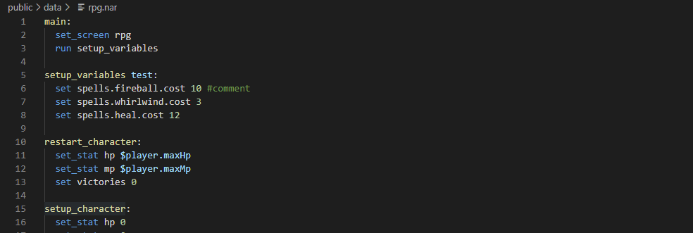
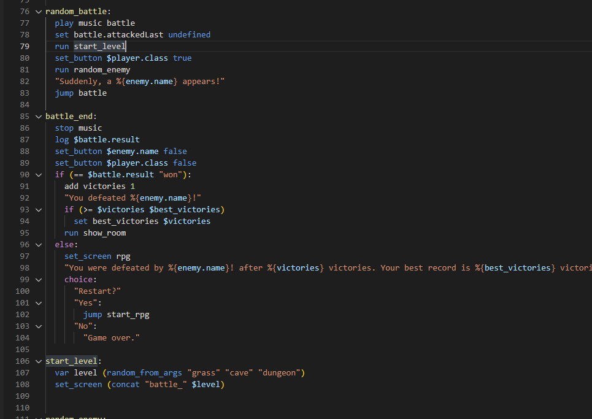

# Narrat Syntax Highlighting for VS Code

An extension that adds rich support for the [Narrat](https://get-narrat.com) programming language to [Visual Studio Code](https://code.visualstudio.com).

## Features

### Syntax Highlighting

> The syntax highlighting depends on the syntax theme used.

### More to come

- Snippets
- Autocompletion

Feel free to [contribute](./CONTRIBUTING.md) to help!

If you have any issues, open an [issue](https://github.com/liana-p/narrat-syntax-highlighting-vscode/issues) or ask for help on the [Discord](https://discord.gg/Xgz7EQ2Xgh)
